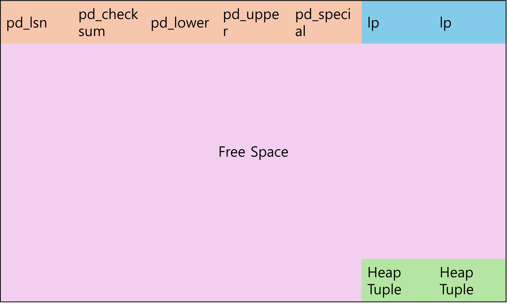

## 페이지의 구조

#### 페이지 구조


```
nano=# SELECT * FROM page_header(get_raw_page('test1','main', 0));
    lsn    | checksum | flags | lower | upper | special | pagesize | version | prune_xid
-----------+----------+-------+-------+-------+---------+----------+---------+-----------
 0/16D8428 |        0 |     0 |    28 |  8160 |    8192 |     8192 |       4 |         0
```
- pd_lsn : 마지막 트랜잭션의 Log Sequence Number(WAL Buffer상의 트랜잭션 로그의 위치)
- pd_checksum : 데이터 무결성 체크를 위한 체크섬 문자열
- pd_lower : 마지막 lp의 위치
- pd_upper : 처음 Heap Tuple의 위치.
- Line Pointer(lp) : 라인포인터, Heap Tuple의 Offset 정보 보유. 페이지 위에서부터 쌓임.
- Heap Tuple : 실제적인 데이터와 데이터와 연관된 트랜잭션ID정보 보관. 페이지 밑바닥부터 쌓임.
- Free Space : 페이지의 여유공간. 라인포인터 마지막(pd_lower)과 맨 위의 힙튜플(pd_upper)의 중간의 빈공간을 의미함.

#### Heap Tuple의 구조


```
nano=# SELECT * FROM heap_page_items(get_raw_page('test1', 0));
 lp | lp_off | lp_flags | lp_len | t_xmin | t_xmax | t_field3 | t_ctid | t_infomask2 | t_infomask | t_hoff | t_bits | t_oid |   t_data
----+--------+----------+--------+--------+--------+----------+--------+-------------+------------+--------+--------+-------+------------
  1 |   8160 |        1 |     28 |    492 |      0 |        0 | (0,1)  |           1 |       2048 |     24 |        |       | \x01000000
```
- lp : 라인포인터
- t_xmin : insert시점의 트랜잭션ID
- t_xmax : update, delete 시점의 트랜잭션ID (Commit/Rollback과는 관련이 없음)
- t_ctid : 해당 튜플의 위치 (Tuple ID = Page index + linepointer index (offset))
- t_cid : 트랜잭션 내에서의 명령 순번. 예를 들어 해당 튜플이 begin 이후 두 번째 명령에서 변경되었다면 2가 입력된다.
- t_infomask : 16진수 4자리수로(2진수 16비트) 이루어진 플래그이다. 주로 해당 튜플의 commit/rollback여부, frozen 등 내부로직처리에 필요한 속성을 담고 있다.
- t_infomask2 : 주로 multi transaction과 연관된 정보를 담고 있다.
- userdata : 실제적인 데이터이다.

#### infomask 각 마스킹 비트 별 설명
| 16진수 | 이진 비트 | 소스 상 정의 | 설명 | 
| --- | --- | --- | --- |
| 0x0001 | 0000000000000001 | HEAP_HASNULL | 해당 튜플에 Null값을 가진 속성이 존재함 |
| 0x0002 | 0000000000000010 | HEAP_HASVARWIDTH | 가변길이 속성을 포함 |
| 0x0004 | 0000000000000100 | HEAP_HASEXTERNAL | TOAST(외부 스토리지) 속성을 포함 |
| 0x0008 | 0000000000001000 | HEAP_HASOID_OLD | 예전 PostgreSQL버전에 사용되던 오브젝트ID필드 포함 |
| 0x0010 | 0000000000010000 | HEAP_XMAX_KEYSHR_LOCK | XMAX가 공유모드 잠금 상태임 |
| 0x0020 | 0000000000100000 | HEAP_COMBOCID | t_cid필드가 콤보CID(Combo Command ID) 상태임 |
| 0x0040 | 0000000001000000 | HEAP_XMAX_EXCL_LOCK | XMAX가 배타모드 잠금 상태임 |
| 0x0080 | 0000000010000000 | HEAP_XMAX_LOCK_ONLY | XMAX가 락 전용 필드임. (단순 잠금용도이며, 실제 delete되지는 않은 튜플임을 나타냄) |
| 0x0050 | 0000000001010000 | HEAP_XMAX_SHR_LOCK | XMAX가 공유모드 잠금을 나타냄. |
| 0x0050 | 0000000001010000 | HEAP_LOCK_MASK | XMAX가 공유모드 잠금을 나타냄 | 
| 0x0100 | 0000000100000000 | HEAP_XMIN_COMMITTED | t_xmin이 커밋된 상태 (이 튜플을 생성한 트랜잭션이 커밋된 상태임) |
| 0x0200 | 0000001000000000 | HEAP_XMIN_INVALID | t_xmin이 무효, 중단됨 (Rollback/Abort) |
| 0x0600 | 0000001100000000 | HEAP_XMIN_FROZEN | t_xmin이 Frozen 상태임 (Vacuum Freeze된 상태) |
| 0x0400 | 0000010000000000 | HEAP_XMAX_COMMITTED | t_xmax 트랜잭션이 커밋된 상태 (이 튜플을 삭제한 트랜잭션이 커밋되었음) |
| 0x0800 | 0000100000000000 | HEAP_XMAX_INVALID | t_xmax 트랜잭션이 무효, 중단됨 (Rollback/Abort) |
| 0x1000 | 0001000000000000 | HEAP_XMAX_IS_MULTI | t_xmax가 MultiXactId임. (여러 트랜잭션이 동시에 잠금을 걸었음) |
| 0x2000 | 0010000000000000 | HEAP_UPDATED | 이 튜플이 Update된 상태 |
| 0x4000 | 0100000000000000 | HEAP_MOVED_OFF | 튜플이 다른 위치로 이동됨 |
| 0x8000 | 1000000000000000 | HEAP_MOVED_IN | 튜플이 다른 위치에서 이동되어 들어옴 |
| 0xC000 | 1100000000000000 | HEAP_MOVED | 튜플이 이동됨 |
- HEAP_XMAX_SHR_LOCK = HEAP_XMAX_EXCL_LOCK | HEAP_XMAX_KEYSHR_LOCK
- HEAP_LOCK_MASK = HEAP_XMAX_SHR_LOCK | HEAP_XMAX_EXCL_LOCK | HEAP_XMAX_KEYSHR_LOCK
- HEAP_XMIN_FROZEN = HEAP_XMIN_COMMITTED | HEAP_XMIN_INVALID
- HEAP_MOVED = HEAP_MOVED_OFF | HEAP_MOVED_IN

#### 마스킹연산
- 튜플의 상태를 파악하기 위해 위에서 열거한 마스킹 비트와 실제 infomask값을 AND연산한 결과값을 구해야 한다.
- 예를 들어 infomask가 0000000100000000인 상태에서 해당 튜플이 Null속성을 보유했는지를 체크하려면 다음과 같이 하면 된다.
  | | | | | | | | | | | | | | | | | |
  | -- | -- | -- | -- | -- | -- | -- | -- | -- | -- | -- | -- | -- | -- | -- | -- | -- |
  | INFOMASK값 | 0 | 0 | 0 | 0 | 0 | 0 | 0 | 1 | 0 | 0 | 0 | 0 | 0 | 0 | 0 | 0 |
  | HEAP_HASNULL | 0 | 0 | 0 | 0 | 0 | 0 | 0 | 0 | 0 | 0 | 0 | 0 | 0 | 0 | 0 | 1 |
  | INFOMASK & HEAP_HASNULL | 0 | 0 | 0 | 0 | 0 | 0 | 0 | 0 | 0 | 0 | 0 | 0 | 0 | 0 | 0 | 0 | 0 |
  - INFOMASK & HEAP_HASNULL 값이 0x0000 = 0이므로 해당 튜플은 Null속성을 보유하지 않았다고 해석할 수 있다.
- 동일한 infomask값으로 이번에는 t_xmin이 커밋된 상태인지를 체크하려면 다음과 같다.
  | | | | | | | | | | | | | | | | | |
  | -- | -- | -- | -- | -- | -- | -- | -- | -- | -- | -- | -- | -- | -- | -- | -- | -- |
  | INFOMASK값 | 0 | 0 | 0 | 0 | 0 | 0 | 0 | 1 | 0 | 0 | 0 | 0 | 0 | 0 | 0 | 0 |
  | HEAP_XMIN_COMMITTED | 0 | 0 | 0 | 0 | 0 | 0 | 0 | 1 | 0 | 0 | 0 | 0 | 0 | 0 | 0 | 0 | 
  | INFOMASK & HEAP_XMIN_COMMITTED | 0 | 0 | 0 | 0 | 0 | 0 | 0 | 1 | 0 | 0 | 0 | 0 | 0 | 0 | 0 | 0 |
- INFOMASK & HEAP_XMIN_COMMITTED = 0000010000000000 = 0x0100 = HEAP_XMIN_COMMITTED이므로, t_xmin 트랜잭션은 커밋상태임을 확인할 수 있다.
  

#### 빈 테이블의 페이지 조회
```
nano=# truncate table test1;
TRUNCATE TABLE
nano=# SELECT * FROM page_header(get_raw_page('test1','main', 0));
ERROR:  block number 0 is out of range for relation "test1"
nano=# SELECT * FROM heap_page_items(get_raw_page('test1', 0));
ERROR:  block number 0 is out of range for relation "test1"
```
- 생성 직후 또는 Truncate 직후의 빈 테이블에는 페이지가 없으므로 에러 발생.
- 데이터파일도 0 Byte임

#### Insert 수행 시 페이지 구조
```
nano=# insert into test1 values (1);
INSERT 0 1
nano=# SELECT * FROM page_header(get_raw_page('test1','main', 0));
    lsn    | checksum | flags | lower | upper | special | pagesize | version | prune_xid
-----------+----------+-------+-------+-------+---------+----------+---------+-----------
 0/50038F0 |        0 |     0 |    28 |  8160 |    8192 |     8192 |       4 |         0
(1 row)

nano=# SELECT * FROM heap_page_items(get_raw_page('test1', 0));
 lp | lp_off | lp_flags | lp_len | t_xmin | t_xmax | t_field3 | t_ctid | t_infomask2 | t_infomask | t_hoff | t_bits | t_oid |   t_data
----+--------+----------+--------+--------+--------+----------+--------+-------------+------------+--------+--------+-------+------------
  1 |   8160 |        1 |     28 |    517 |      0 |        0 | (0,1)  |           1 |       2048 |     24 |        |       | \x01000000

nano=# insert into test1 values (2);
INSERT 0 1
nano=# insert into test1 values (3);
INSERT 0 1
nano=# SELECT * FROM heap_page_items(get_raw_page('test1', 0));
 lp | lp_off | lp_flags | lp_len | t_xmin | t_xmax | t_field3 | t_ctid | t_infomask2 | t_infomask | t_hoff | t_bits | t_oid |   t_data
----+--------+----------+--------+--------+--------+----------+--------+-------------+------------+--------+--------+-------+------------
  1 |   8160 |        1 |     28 |    517 |      0 |        0 | (0,1)  |           1 |       2048 |     24 |        |       | \x01000000
  2 |   8128 |        1 |     28 |    518 |      0 |        0 | (0,2)  |           1 |       2048 |     24 |        |       | \x02000000
  3 |   8096 |        1 |     28 |    519 |      0 |        0 | (0,3)  |           1 |       2048 |     24 |        |       | \x03000000
(3 rows)
```
- 1번 데이터는 트랜잭션 ID 517번에 튜플 오프셋은 0,1임. 2,3번도 마찬가지
- atocommit on이므로 매 insert시마다 commit되었으므로, 세 insert문의 트랜잭션은 제각각이고, 각각 트랜잭션ID를 하나씩 받아 t_xmin에 표시됨.

#### 1번 데이터 Delete 후 페이지 구조
```
nano=# delete from test1 where col1 = 1;
DELETE 1
nano=# SELECT * FROM heap_page_items(get_raw_page('test1', 0));
 lp | lp_off | lp_flags | lp_len | t_xmin | t_xmax | t_field3 | t_ctid | t_infomask2 | t_infomask | t_hoff | t_bits | t_oid |   t_data
----+--------+----------+--------+--------+--------+----------+--------+-------------+------------+--------+--------+-------+------------
  1 |   8160 |        1 |     28 |    517 |    520 |        0 | (0,1)  |        8193 |        256 |     24 |        |       | \x01000000
  2 |   8128 |        1 |     28 |    518 |      0 |        0 | (0,2)  |           1 |       2048 |     24 |        |       | \x02000000
  3 |   8096 |        1 |     28 |    519 |      0 |        0 | (0,3)  |           1 |       2048 |     24 |        |       | \x03000000
(3 rows)

nano=# SELECT lp, t_xmin, t_xmax, t_infomask::bit(16) as t_infomask, t_data FROM heap_page_items(get_raw_page('test1', 0));
 lp | t_xmin | t_xmax |    t_infomask    |   t_data
----+--------+--------+------------------+------------
  1 |    517 |    520 | 0000000100000000 | \x01000000
  2 |    518 |      0 | 0000100000000000 | \x02000000
  3 |    519 |      0 | 0000100000000000 | \x03000000
```
- 1번 데이터(lp=1) delete시점의 트랜잭션 ID가 520번임(t_xmax)
- 1번 데이터의 t_infomask가 0000000100000000임. 분석 필요

#### 2번 데이터 Update 후 페이지 구조
```
nano=# update test1 set col1=4 where col1=2;
UPDATE 1
nano=# SELECT * FROM heap_page_items(get_raw_page('test1', 0));
 lp | lp_off | lp_flags | lp_len | t_xmin | t_xmax | t_field3 | t_ctid | t_infomask2 | t_infomask | t_hoff | t_bits | t_oid |   t_data
----+--------+----------+--------+--------+--------+----------+--------+-------------+------------+--------+--------+-------+------------
  1 |   8160 |        1 |     28 |    517 |    520 |        0 | (0,1)  |        8193 |        256 |     24 |        |       | \x01000000
  2 |   8128 |        1 |     28 |    518 |    521 |        0 | (0,4)  |        8193 |        256 |     24 |        |       | \x02000000
  3 |   8096 |        1 |     28 |    519 |      0 |        0 | (0,3)  |           1 |       2048 |     24 |        |       | \x03000000
  4 |   8064 |        1 |     28 |    521 |      0 |        0 | (0,4)  |           1 |      10240 |     24 |        |       | \x04000000
(4 rows)

nano=# SELECT lp, t_xmin, t_xmax, t_infomask::bit(16) as t_infomask, t_data FROM heap_page_items(get_raw_page('test1', 0));
 lp | t_xmin | t_xmax |    t_infomask    |   t_data
----+--------+--------+------------------+------------
  1 |    517 |    520 | 0000000100000000 | \x01000000
  2 |    518 |    521 | 0000000100000000 | \x02000000
  3 |    519 |      0 | 0000100000000000 | \x03000000
  4 |    521 |      0 | 0010100000000000 | \x04000000
(4 rows)
```
- 2번 데이터(lp=2)의 t_xmax에 update시점의 트랜잭션ID인 521로 표시됨.
- 2번 데이터의 위치정보(t_ctid)가 자기위치(0,2)가 아닌 새 튜플의 위치인 (0,4)를 가리키고 있음.
- lp=4의 튜플의 신규생성되었고, 방금 Update된 데이터 4를 가지고 있음.

#### autocommit off, begin ~ commit 블록 내에서 Insert쿼리 3번 실행
```
nano=# \set autocommit off;
nano=# begin;
BEGIN
nano=# insert into test1 values (5);
INSERT 0 1
nano=# insert into test1 values (6);
INSERT 0 1
nano=# insert into test1 values (7);
INSERT 0 1
nano=# commit;
COMMIT
nano=# SELECT * FROM heap_page_items(get_raw_page('test1', 0));
 lp | lp_off | lp_flags | lp_len | t_xmin | t_xmax | t_field3 | t_ctid | t_infomask2 | t_infomask | t_hoff | t_bits | t_oid |   t_data
----+--------+----------+--------+--------+--------+----------+--------+-------------+------------+--------+--------+-------+------------
  1 |   8160 |        1 |     28 |    517 |    520 |        0 | (0,1)  |        8193 |        256 |     24 |        |       | \x01000000
  2 |   8128 |        1 |     28 |    518 |    521 |        0 | (0,4)  |        8193 |        256 |     24 |        |       | \x02000000
  3 |   8096 |        1 |     28 |    519 |      0 |        0 | (0,3)  |           1 |       2048 |     24 |        |       | \x03000000
  4 |   8064 |        1 |     28 |    521 |      0 |        0 | (0,4)  |           1 |      10240 |     24 |        |       | \x04000000
  5 |   8032 |        1 |     28 |    522 |      0 |        0 | (0,5)  |           1 |       2048 |     24 |        |       | \x05000000
  6 |   8000 |        1 |     28 |    522 |      0 |        1 | (0,6)  |           1 |       2048 |     24 |        |       | \x06000000
  7 |   7968 |        1 |     28 |    522 |      0 |        2 | (0,7)  |           1 |       2048 |     24 |        |       | \x07000000
(7 rows)

nano=# SELECT lp, t_xmin, t_xmax, t_infomask::bit(16) as t_infomask, t_data FROM heap_page_items(get_raw_page('test1', 0));
 lp | t_xmin | t_xmax |    t_infomask    |   t_data
----+--------+--------+------------------+------------
  1 |    517 |    520 | 0000000100000000 | \x01000000
  2 |    518 |    521 | 0000000100000000 | \x02000000
  3 |    519 |      0 | 0000100000000000 | \x03000000
  4 |    521 |      0 | 0010100000000000 | \x04000000
  5 |    522 |      0 | 0000100000000000 | \x05000000
  6 |    522 |      0 | 0000100000000000 | \x06000000
  7 |    522 |      0 | 0000100000000000 | \x07000000
(7 rows)

nano=#
```
- lp값 5,6,7번의 t_xmin값이 522로 모두 동일함. 같은 begin ~ commit; 내에 있어서 하나의 트랜잭션에서 동작했음을 의미한다.
- 5,6,7번의 t_field3값이 0,1,2로 되어 있어 begin ~ commit; 내의 실행순서를 표시한다. t_field3값이 아마 t_cid값을 의미하는 듯 하다.

